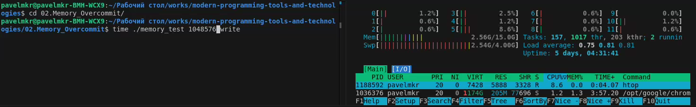
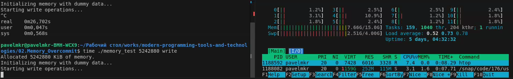
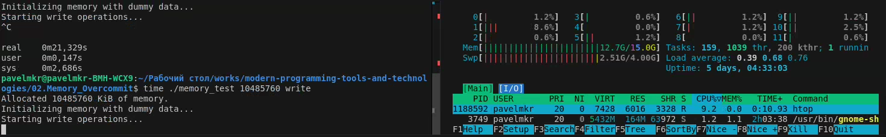
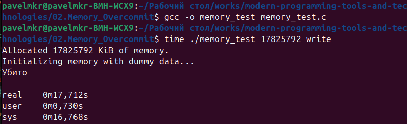
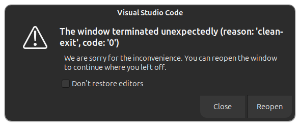
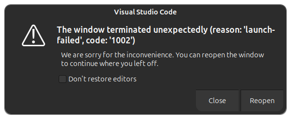
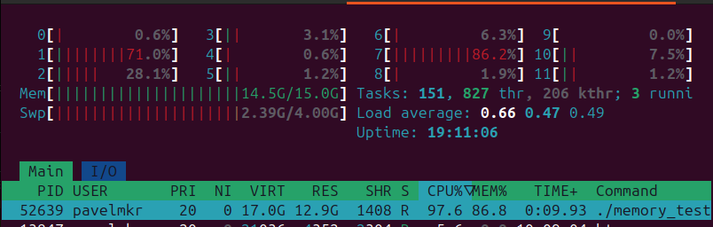
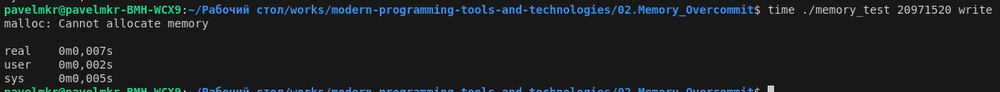

# Отчёт по 02.Memory_Overcommit
## Задание

## Конфигурация ПК
1) Ubuntu
- Система: Ubuntu 24.04.1 LTS;
- Компилятор: gcc 13.2.0;
2) Windows 11
- Система: Windows 11;
- Компилятор: gcc ;
## Ход работы
### Ubuntu:

Изначально занято 2.56 Гб из 15.0 Гб:

При записи 5 Гб, загрузка доходит до 7.66 Гб:

При записи 10 Гб, загрузка доходит до 12.7 Гб, справится за n-ное количество времени:

При записи 14 Гб, загрузка доходит до 14.1 Гб, после vscode вылетает с ошибкой:

Итог запуска записи 14 Гб через vscode:

Перезапуск vscode, если использовать reopen:

Результат запуска записи 14 Гб через встроенный Terminal:

Загрузка через htop при записи 14 Гб через встроенный Terminal:

Результат при записи 20 Гб, вылет из-за нехватки памяти:

# Результат
