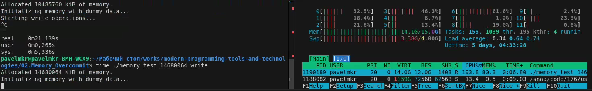
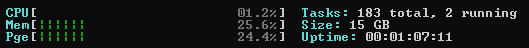
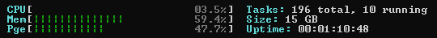
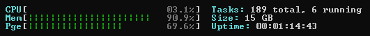
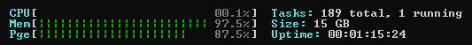
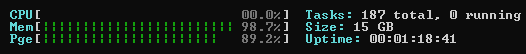
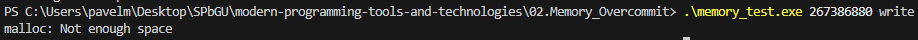

# Отчёт по 02.Memory_Overcommit
## Задание

- Выделить заведомо сликом большое количество памяти при помощи malloc (предпочтительно) или объявления глобального массива. Количество памяти задать параметром командной строки.
- С шагом в 4 КиБ (вероятно минимальный размер страницы на вашем компьютере) обращаться к этой памяти на чтение или на запись. Для того, чтобы задать, идёт обращение на чтение или на запись, использовать параметр командной строки.
- Чтобы процесс был управляемым, раз в неколько тысяч (или десятков, или сотен тысяч, решите сами) обращений делайте паузу на несколько десятков или сотен (тоже решите сами) миллисекунд. Чтобы ОС превращалась в тыкву управлямо.
- Пронаблюдайте за потреблением памяти при помощи системных инструментов. В каких случаях оно будет расти, в каких — нет.
- Если у вас есть возможность, попробуйте испытать программу под разными ОС.

## Конфигурация ПК
1) Ubuntu
- Система: Ubuntu 24.04.1 LTS;
- Компилятор: gcc 13.2.0;
- Мониторинг процессов: htop.
2) Windows 11
- Система: Windows 11 23H2;
- Компилятор: gcc 14.2.0;
- Мониторинг процессов: ntop.
## Ход работы
### Ubuntu:

Изначально занято 2.56 Гб из 15.0 Гб:

При записи 5 Гб, загрузка доходит до 7.66 Гб:

При записи 10 Гб, загрузка доходит до 12.7 Гб:

При записи 14 Гб, загрузка доходит до 14.1 Гб, после vscode вылетает с ошибкой:

Итог запуска записи 14 Гб через vscode:

Перезапуск vscode, если использовать reopen:

Результат запуска записи 14 Гб через встроенный Terminal:

Загрузка через htop при записи 14 Гб через встроенный Terminal:

Результат при записи 20 Гб, вылет из-за нехватки памяти:

### Windows:

Изначально занято 24.5% (~3.68 Гб) из 15.0 Гб:

При записи 5 Гб, загрузка доходит до 59.4% (~8.91 Гб):

При записи 10 Гб, загрузка доходит до 90.9% (~13.64 Гб):

При записи 14 Гб, загрузка доходит до 97.5% (~14.63 Гб):

При записи 20 Гб, загрузка доходит до 98.7% (~14.8 Гб):

В случае записи большого объема (например 255 Гб), ошибка malloc о нехватке места:

# Результат

При примерно равной нагрузке как на Windows, так и на Ubuntu, с большим объемом записи успешно справляется Windows. В Ubuntu это приводит либо к вылету (vscode), либо к принудительной остановке (Terminal)