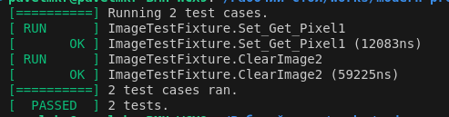
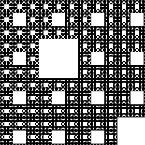

# 3.A. Фрактал
## Задача
C/доделать программу, котрая рисует несколько видов фракталов и сохраняет изображения с ними в любом графическом формате. Примеры фракталов — множество Julia, ковёр Серпинского и т.д. — ищем сами.

- Опираемся, по желанию на этот пример.
- Соблюдаем требование, описанные выше в задании.
- Задачу выполняем в каталоге 03.Fractal.

## Ход работы
1) Написание функции empty_fractal в fractal.h, используем в качестве фрактала Ковёр Серпинского
1) Создание CMakeLists.txt, настройка на сборку с utest
1) Создаём Git submodule для utest
    ```
    git submodule add https://github.com/sheredom/utest.h utest
    ```
    И в test_main.c импортируем utest.h из субмодуля utest (`#include "utest/utest.h"`)
1) Создание папки для файлов CMake:
    ```
    mkdir cmake 
    ```
1) Создание CMake файлов:
    ```
    cd build/
    cmake ..
    ```
1) Сборка проекта:
    ```
    make
    ```
1) Запуск бинарных файлов:
    ```
    ./test_fractal
    ./fractal
    ```
## Результат
#### Результат ./test_fractal:



#### Результат ./fractal (конвертировано в png с помощью сторонних инструментов):


